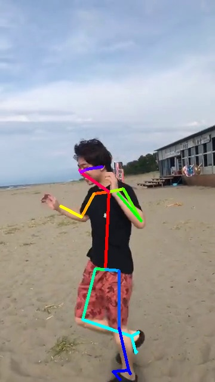

# openpose_ext
openpose_ext は [OpenPose](https://github.com/CMU-Perceptual-Computing-Lab/openpose) という姿勢推定ライブラリを使用した開発環境の雛形のようなものです。
これを使用することにより姿勢推定を簡単に行うことができます。
たとえば、1枚の画像から姿勢推定を行う場合には `main.cpp` を以下のように書き換えることで実現できます。

```C++
#include <OpenPoseWrapper/MinimumOpenPose.h>
#include <Utils/PlotInfo.h>

int main()
{
	MinOpenPose openpose(op::PoseModel::BODY_25, op::Point<int>(-1, 368));
	cv::Mat image = cv::imread("media/human.jpg");
	auto people = openpose.estimate(image);
	plotBone(image, people, openpose);
	cv::imshow("result", image);
	cv::waitKey(0);
	return 0;
}
```

入力画像と出力画像

 

# 留意点
このプログラムは可読性を優先しているため OpenPose の処理速度は本来の速度よりも低下します。
OpenPose は画像を GPU に送る処理や解析結果を取得する処理をそれぞれ並列に行っているため、複数の画像を同時に解析することができます。
しかし、マルチスレッドを用いたプログラミングは初心者にとって扱いにくいものです。
そのため、このプログラムでは処理速度を犠牲にして可読性を優先しました。
具体的には OpenPose の姿勢推定を同期関数のように実行できるようにしました。
これは複数の画像を同時に解析できないことを意味します。
結果として処理速度が低下します。
私の環境では8.0fpsから5.0fpsほどに低下しました。

# 使用方法
## 準備
### Visual Studio Community 2019のインストール
既にインストールされている場合はこの手順は飛ばしてください。

以下のURLより、Visual Studio Community 2019をダウンロード、インストールします。

[https://visualstudio.microsoft.com/ja/downloads/](https://visualstudio.microsoft.com/ja/downloads/)

### gitのインストール
既にインストールされている場合はこの手順は飛ばしてください。

まず Visual Studio Installer を起動します。
スタートメニューから `Visual Studio Installer` と入力すると見つかると思います。
起動すると、 `インストール済み` の中に `Visual Studio Community 2019` があります。
もしも `Visual Studio Community 2019` に `更新` ボタンがあれば、それを押して更新を行います。
`Visual Studio Community 2019` の `変更` ボタンを押し `個別のコンポーネント` を押します。
その下の一覧から `Git for Windows` にチェックし、右下の `変更` を押します。 

### CMakeのインストール
既にインストールされている場合はこの手順は飛ばしてください。

以下のURLより `cmake-x.x.x-win64-x64.msi` (x.x.xはバージョン) をダウンロード、インストールします。

[https://cmake.org/download/](https://cmake.org/download/)

注意点として、インストーラーの途中に`Choose options for installing CMake`という選択画面があるので`Add CMake to the system PATH for all users`を選択します。

### CUDAとcuDNNのインストール
既にインストールされている場合はこの手順は飛ばしてください。

以下のURLより CUDA 10.1 をダウンロード、インストールします。

[https://developer.nvidia.com/cuda-10.1-download-archive-base](https://developer.nvidia.com/cuda-10.1-download-archive-base)

次に CUDA 10.1 に対応する cuDNN をインストールします。
以下のURLよりダウンロード、インストールしてください。(アカウント登録が必要です)

[https://developer.nvidia.com/rdp/cudnn-download](https://developer.nvidia.com/rdp/cudnn-download)

## 環境構築
エクスプローラーで openpose_ext をダウンロードしたい場所を開きます。
次に、エクスプローラーのアドレスバーに `cmd` と入力します。
コマンドプロンプトが起動するので `git clone https://github.com/wakewakame/openpose_ext` と入力し、エンターを押します。
これで openpose_ext のプログラムがダウンロードされます。
次に、コマンドプロンプトで以下のコマンドを続けて入力します

`cd openpose_ext` (openpose_extフォルダに移動)

`mkdir build` (buildフォルダの生成)

`cd build` (buildフォルダに移動)

`cmake ..` (openpose_extフォルダに対してCMakeを実行)

この`cmake ..`の処理には数十分から数時間ほどかかることがあります。
以上の処理が成功すると、openpose_extフォルダ内のbuildフォルダに`openpose_ext.sln`が生成されます。

## ビルド
openpose_extフォルダ内のbuildフォルダに生成された `openpose_ext.sln` を開きます。
画面上部の`ローカル Windows デバッガー`を押し、ビルドを開始します。
ビルドが終わると、openpose_extが起動します。

# ファイル構成

| ファイル名                 | 説明 |
| :---                    | :--- |
| main.cpp                | このプログラムにmain関数が書かれています。基本的にはこのファイルを書き換えて開発をします。 |
| examples                | サンプルプログラムがいくつか入っています。 |
| include                 | C++のヘッダファイルがまとまっています。 |
| include/OpenPoseWrapper | OpenPoseをシンプルに扱えるようにするためのプログラムが入っています。 |
| include/Utils           | 動画再生や画像のプレビューなどを簡単にするための雑多なプログラムがいくつか入っています。 |
| src                     | C++のソースファイルがまとまっています。 |
| CMakeLists.txt          | CMakeLists.txtです。CMakeで環境構築するので、それに使います。 |